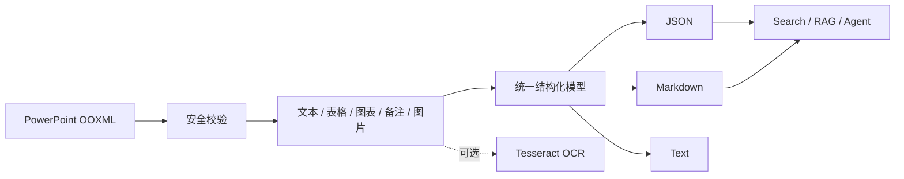

<div align="center">

# pptx_extraction

### 面向检索、RAG 与 Agent 的 PowerPoint 结构化内容提取工具

[](https://github.com/BlairCode/pptx_extraction/actions/workflows/ci.yml)
[](https://www.python.org/)
[](https://github.com/BlairCode/pptx_extraction/releases)
[](LICENSE)
[](schemas/pptx-extraction.presentation.v1.schema.json)

**默认离线 · 可追溯 · 跨平台 · CLI / Python API / HTTP API / Agent Skill**

[快速开始](#快速开始) · [常用工作流](#常用工作流) · [输出说明](#输出说明) · [完整文档](#完整文档)

</div>

---

`pptx_extraction` 将 PowerPoint 文件转换为带来源定位的 JSON、Markdown 和纯文本。它不仅提取
“看得见的文字”，还保留页码、段落层级、视觉阅读顺序、原始堆叠顺序、shape 信息、坐标、
表格、图表数据、备注、链接、图片哈希与告警，适合知识库构建、内容迁移、无障碍审计和 Agent
读取等需要可靠引用来源的场景。

> 项目保持原仓库名称 `pptx_extraction`。安装包名称为 `pptx-extraction`，Python 导入名为
> `pptx_extraction`，命令行入口为 `pptx-extraction`。

## 核心能力

| 能力 | 处理结果 |
|---|---|
| 文本与链接 | 标题/正文、段落层级、超链接、shape ID/name、坐标 |
| 表格与图表 | 原生单元格、图表分类、序列名与数值；不使用 OCR 猜测数据 |
| 图片与 OCR | SHA-256 命名、跨页去重、alt text、可选 Tesseract OCR |
| 备注与隐藏页 | speaker notes 独立输出；隐藏页保留并标记 `hidden: true` |
| 可追溯性 | 每个元素保留页码、阅读顺序、z-order 和归一化位置 |
| 安全与隐私 | 不联网、不执行宏；检查 ZIP 路径穿越、压缩炸弹与异常包 |
| 工程接口 | 单文件、批处理、Python API、异步 HTTP API、Agent Skill |



## 支持范围

| 文件类型 | 支持方式 |
|---|---|
| `.pptx` / `.pptm` / `.potx` / `.ppsx` | 直接解析；宏只检测、不执行 |
| `.ppt` / `.pot` / `.pps` | 使用 `convert` 命令调用本机 LibreOffice 转换 |
| `.pdf` | 不支持；请先使用 PDF 专用工具 |
| SmartArt / OLE / 音视频 / 动画 | 可能只能得到部分信息，并在可检测时输出告警 |

## 快速开始

下面的命令可以直接复制。示例输入为 `slides.pptx`，请替换为你的真实文件路径。

### 1. 克隆并进入现有仓库

```bash
git clone https://github.com/BlairCode/pptx_extraction.git
cd pptx_extraction
```

### 2. 创建虚拟环境

Windows PowerShell：

```powershell
python -m venv .venv
.\.venv\Scripts\Activate.ps1
python -m pip install --upgrade pip
python -m pip install -e .
```

Linux / macOS：

```bash
python3 -m venv .venv
source .venv/bin/activate
python -m pip install --upgrade pip
python -m pip install -e .
```

确认安装成功：

```bash
pptx-extraction --version
```

预期输出：

```text
pptx_extraction 2.0.0
```

### 3. 校验并提取第一份 PPTX

```bash
pptx-extraction validate "slides.pptx"
pptx-extraction extract "slides.pptx" \
  --output "output/slides" \
  --format json \
  --format markdown \
  --format text \
  --redact-metadata
```

PowerShell 如果不使用反引号续行，建议直接写成一行：

```powershell
pptx-extraction extract "slides.pptx" --output "output/slides" --format json --format markdown --format text --redact-metadata
```

首次运行后会得到：

```text
output/slides/
├── presentation.json     # 完整结构化数据，适合程序、RAG 与 Agent
├── presentation.md       # 按页整理，适合阅读和快速检查
├── presentation.txt      # 无 Markdown 标记的纯文本
└── assets/               # 按内容哈希命名并去重的嵌入图片
```

再次写入同一非空目录时，程序会保护已有文件并停止。确认该目录可以替换后再加：

```bash
pptx-extraction extract "slides.pptx" -o "output/slides" --overwrite
```

## 输出说明

`presentation.json` 是最完整的结果。常用字段如下：

| 字段 | 含义 |
|---|---|
| `schema_version` | 当前数据契约版本，现为 `1.0` |
| `source_sha256` | 输入文件内容哈希，用于区分不同版本 |
| `slides[].number` | 1 开始的幻灯片页码 |
| `slides[].text_blocks` | 标题/正文、层级、链接与来源 shape |
| `slides[].tables` | 表格二维单元格数据 |
| `slides[].charts` | 图表标题、分类、序列和数值 |
| `slides[].images` | 图片哈希、路径、alt text 与可选 OCR |
| `slides[].notes` | 演讲者备注，不与正文混合 |
| `order` / `z_order` | 视觉阅读顺序 / PowerPoint 原始堆叠顺序 |
| `bbox` | points 坐标和 0–1 归一化坐标 |
| `warnings` | 缺少 alt text、宏、未支持对象等限制 |

完整约束见 [JSON Schema](schemas/pptx-extraction.presentation.v1.schema.json)。

## 常用工作流

### 只检查内容概况，不生成文件

```bash
pptx-extraction inspect "slides.pptx"
```

输出完整 JSON 记录，同时隐藏作者等元数据：

```bash
pptx-extraction inspect "slides.pptx" --full --redact-metadata
```

### 批量处理目录

递归发现目录中的受支持文件，使用 4 个工作线程：

```bash
pptx-extraction batch "./decks" --output "./output" --workers 4 --redact-metadata
```

同时传入多个文件或目录：

```bash
pptx-extraction batch "deck-a.pptx" "deck-b.pptx" "./more-decks" -o "./output"
```

每个输入会写入独立目录，目录名包含源文件哈希前缀；单个文件失败不会中断其他任务。只要有一项
失败，命令退出码为 `4`，失败原因会写在终端 JSON 中。

### 识别嵌入图片中的文字

先安装 Python OCR 适配器：

```bash
python -m pip install -e ".[ocr]"
```

再安装系统级 Tesseract 和所需语言包，然后运行：

```bash
pptx-extraction extract "slides.pptx" -o "output/ocr" \
  --ocr tesseract \
  --ocr-language "chi_sim+eng"
```

OCR 只处理 PPTX 中的嵌入图片，不会渲染整页幻灯片。同一图片即使跨页重复，也只识别一次。

### 转换旧版 `.ppt`

先安装 LibreOffice，并确保 `soffice` 在 `PATH` 中：

```bash
pptx-extraction convert "legacy.ppt" --output "converted"
pptx-extraction extract "converted/legacy.pptx" --output "output/legacy"
```

如果 `soffice` 不在 `PATH`，Windows 可显式指定：

```powershell
pptx-extraction convert "legacy.ppt" -o "converted" --soffice "$env:ProgramFiles\LibreOffice\program\soffice.exe"
```

### Python API

```python
from pptx_extraction import ExtractionOptions, extract_file

result = extract_file(
    "slides.pptx",
    "output/python-api",
    options=ExtractionOptions(
        include_assets=True,
        include_notes=True,
        redact_metadata=True,
    ),
    formats=("json", "markdown", "text"),
)

print(result.output_dir)
print(result.record.summary)
```

### HTTP API

安装并启动：

```bash
python -m pip install -e ".[api]"
uvicorn pptx_extraction.api:create_app --factory --host 127.0.0.1 --port 8000
```

新开一个 PowerShell 窗口上传文件并轮询结果：

```powershell
$job = curl.exe -s -X POST -F "file=@slides.pptx" http://127.0.0.1:8000/v1/jobs | ConvertFrom-Json
$job

$status = $null
do {
  Start-Sleep -Seconds 1
  $status = curl.exe -s "http://127.0.0.1:8000/v1/jobs/$($job.id)" | ConvertFrom-Json
  $status
} while ($status.status -in @("queued", "running"))

if ($status.status -ne "succeeded") {
  throw "Extraction failed: $($status.error)"
}

curl.exe -s "http://127.0.0.1:8000/v1/jobs/$($job.id)/result" -o presentation.json
```

状态为 `succeeded` 后才能读取结果。接口说明和生产部署边界见 [docs/api.md](docs/api.md)。

## CLI 速查

| 命令 | 用途 | 是否写文件 |
|---|---|---|
| `pptx-extraction validate FILE` | 检查格式、OOXML 结构与安全限制 | 否 |
| `pptx-extraction inspect FILE` | 查看页数和元素统计 | 否 |
| `pptx-extraction extract FILE -o DIR` | 提取单个文件 | 是 |
| `pptx-extraction batch INPUT... -o DIR` | 并发批处理文件/目录 | 是 |
| `pptx-extraction convert FILE.ppt -o DIR` | 通过 LibreOffice 转换旧格式 | 是 |
| `pptx-extraction COMMAND --help` | 查看某个命令的全部参数 | 否 |

稳定退出码：`0` 成功，`2` 参数/输入问题，`3` 提取失败，`4` 批处理部分失败，`5` 缺少可选依赖。

## Agent Skill

可复用 Skill 位于 [`agent-skill/pptx-extraction`](agent-skill/pptx-extraction)：

```bash
python agent-skill/pptx-extraction/scripts/extract.py \
  "slides.pptx" \
  --output "output/agent-run"
```

它会默认脱敏作者类元数据，并指导 Agent 区分正文、备注、图表值和 OCR 派生文本。Skill 已通过官方
`quick_validate.py`，发布脚本会将项目和 Skill 生成两个独立 ZIP。

## 开发与验证

```bash
python -m pip install -e ".[dev,api]"
ruff check .
ruff format --check .
mypy src/pptx_extraction
pytest
python -m build
python scripts/privacy_scan.py
python scripts/build_release.py
```

测试在运行时合成 PPTX，不提交真实演示文稿、导出图片或个人音频。CI 覆盖 Python 3.10–3.12。

<details>
<summary><strong>常见问题：输出目录已存在</strong></summary>

程序不会默认覆盖非空目录。选择新的 `--output`，或确认目录只包含本次旧结果后添加
`--overwrite`。不要对工作区根目录、用户目录或不确定的路径使用覆盖选项。

</details>

<details>
<summary><strong>常见问题：PPTX 中明明有内容，但结果缺失</strong></summary>

检查 `warnings`。SmartArt、公式、OLE、动画、音视频和图片型整页可能没有可直接读取的语义。
图片中的文字可尝试 Tesseract；整页图片型幻灯片需要额外的渲染/整页 OCR 工具。

</details>

<details>
<summary><strong>常见问题：OCR 或 LibreOffice 不可用</strong></summary>

OCR 同时需要 `.[ocr]`、Tesseract 可执行程序和语言包。旧版 PPT 转换需要 LibreOffice 的
`soffice`。这两项都是可选依赖，不影响普通 `.pptx` 文本提取。

</details>

## 完整文档

- [需求分析与验收标准](docs/requirements.md)
- [系统架构与模块职责](docs/architecture.md)
- [旧项目审计与逐文件升级计划](docs/upgrade-plan.md)
- [HTTP API](docs/api.md)
- [安全策略](SECURITY.md)
- [更新现有仓库与发布 Release](docs/release.md)
- [参与贡献](CONTRIBUTING.md)

## License

[MIT](LICENSE)
