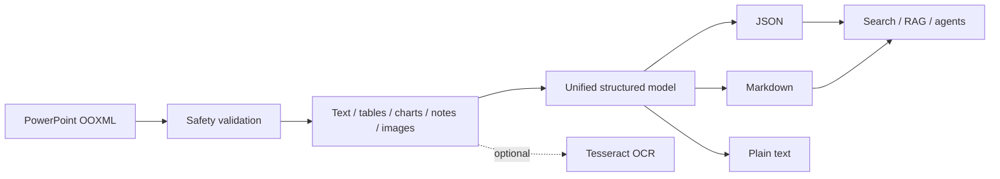

<div align="center">

# pptx_extraction

### Traceable PowerPoint extraction for search, RAG, and AI agents

[](https://github.com/BlairCode/pptx_extraction/actions/workflows/ci.yml)
[](https://www.python.org/)
[](https://github.com/BlairCode/pptx_extraction/releases)
[](LICENSE)
[](schemas/pptx-extraction.presentation.v1.schema.json)

**Offline by default · Source-aware · Cross-platform · CLI / Python API / HTTP API / Agent Skill**

[Quick start](#quick-start) · [Common workflows](#common-workflows) · [Output format](#output-format) · [Documentation](#documentation)

</div>

---

`pptx_extraction` converts PowerPoint presentations into source-aware JSON, Markdown, and
plain text. It goes beyond visible text by preserving slide numbers, paragraph levels,
visual reading order, original z-order, shape metadata, coordinates, tables, chart data,
speaker notes, hyperlinks, image hashes, and extraction warnings.

The resulting data is designed for search indexing, RAG pipelines, knowledge-base ingestion,
content migration, accessibility audits, and AI-agent workflows where every extracted item
must remain traceable to its source.

> The repository name is `pptx_extraction`. The distribution is `pptx-extraction`, the Python
> package is `pptx_extraction`, and the command-line entry point is `pptx-extraction`.

## Highlights

| Capability | What you get |
|---|---|
| Text and links | Titles, body text, paragraph levels, hyperlinks, shape IDs/names, and coordinates |
| Tables and charts | Native cell values, chart categories, series names, and values—without OCR guesswork |
| Images and OCR | SHA-256 asset names, cross-slide deduplication, alt text, and optional Tesseract OCR |
| Notes and hidden slides | Speaker notes stored separately; hidden slides retained with `hidden: true` |
| Traceability | Slide number, visual reading order, z-order, and normalized position for every element |
| Security and privacy | No network access or macro execution; ZIP traversal, compression-bomb, and package checks |
| Integration options | Single-file extraction, batch processing, Python API, asynchronous HTTP API, and Agent Skill |



## Supported formats

| File type | Support |
|---|---|
| `.pptx` / `.pptm` / `.potx` / `.ppsx` | Parsed directly; macros are detected but never executed |
| `.ppt` / `.pot` / `.pps` | Converted through a local LibreOffice installation with the `convert` command |
| `.pdf` | Not supported; use a dedicated PDF extraction tool instead |
| SmartArt / OLE / audio / video / animations | Information may be partial; detectable limitations are reported as warnings |

## Quick start

The commands below are ready to copy. Replace `slides.pptx` with the path to your presentation.

### 1. Clone the repository

```bash
git clone https://github.com/BlairCode/pptx_extraction.git
cd pptx_extraction
```

### 2. Create a virtual environment and install

Windows PowerShell:

```powershell
python -m venv .venv
.\.venv\Scripts\Activate.ps1
python -m pip install --upgrade pip
python -m pip install -e .
```

Linux or macOS:

```bash
python3 -m venv .venv
source .venv/bin/activate
python -m pip install --upgrade pip
python -m pip install -e .
```

Verify the installation:

```bash
pptx-extraction --version
```

Expected output:

```text
pptx_extraction 2.0.0
```

### 3. Validate and extract your first presentation

```bash
pptx-extraction validate "slides.pptx"
pptx-extraction extract "slides.pptx" \
  --output "output/slides" \
  --format json \
  --format markdown \
  --format text \
  --redact-metadata
```

In PowerShell, run the extraction command on one line:

```powershell
pptx-extraction extract "slides.pptx" --output "output/slides" --format json --format markdown --format text --redact-metadata
```

The first run creates:

```text
output/slides/
├── presentation.json     # Complete structured data for applications, RAG, and agents
├── presentation.md       # Slide-by-slide content for reading and review
├── presentation.txt      # Plain text without Markdown syntax
└── assets/               # Deduplicated embedded images named by content hash
```

The extractor refuses to write into an existing non-empty directory by default. After confirming
that the directory can safely be replaced, add `--overwrite`:

```bash
pptx-extraction extract "slides.pptx" -o "output/slides" --overwrite
```

## Output format

`presentation.json` is the canonical and most complete output. Important fields include:

| Field | Meaning |
|---|---|
| `schema_version` | Data-contract version; currently `1.0` |
| `source_sha256` | Content hash of the input file for version identification |
| `slides[].number` | One-based slide number |
| `slides[].text_blocks` | Titles/body text, paragraph levels, links, and source shapes |
| `slides[].tables` | Two-dimensional native table-cell data |
| `slides[].charts` | Chart titles, categories, series, and values |
| `slides[].images` | Image hashes, paths, alt text, and optional OCR results |
| `slides[].notes` | Speaker notes, kept separate from slide content |
| `order` / `z_order` | Visual reading order / original PowerPoint stacking order |
| `bbox` | Coordinates in points and normalized `0–1` coordinates |
| `warnings` | Missing alt text, macros, unsupported objects, and other limitations |

See the [JSON Schema](schemas/pptx-extraction.presentation.v1.schema.json) for the complete contract.

## Common workflows

### Inspect a presentation without writing files

```bash
pptx-extraction inspect "slides.pptx"
```

Print the complete JSON record while redacting author-related metadata:

```bash
pptx-extraction inspect "slides.pptx" --full --redact-metadata
```

### Process a directory in batch

Recursively discover supported files and process them with four workers:

```bash
pptx-extraction batch "./decks" --output "./output" --workers 4 --redact-metadata
```

You may also provide multiple files and directories:

```bash
pptx-extraction batch "deck-a.pptx" "deck-b.pptx" "./more-decks" -o "./output"
```

Each input is written to a separate directory whose name contains the source hash prefix. A failure
in one file does not stop the remaining jobs. If any item fails, the command exits with code `4` and
reports the reason in the terminal JSON output.

### Recognize text inside embedded images

Install the Python OCR adapter:

```bash
python -m pip install -e ".[ocr]"
```

Install Tesseract and the required system language packs, then run:

```bash
pptx-extraction extract "slides.pptx" -o "output/ocr" \
  --ocr tesseract \
  --ocr-language "eng"
```

For Simplified Chinese and English, use `--ocr-language "chi_sim+eng"`. OCR applies only to images
embedded in the OOXML package; it does not render or OCR entire slides. A duplicated image is
recognized only once, even when it appears on multiple slides.

### Convert legacy `.ppt` files

Install LibreOffice and ensure that `soffice` is available on `PATH`:

```bash
pptx-extraction convert "legacy.ppt" --output "converted"
pptx-extraction extract "converted/legacy.pptx" --output "output/legacy"
```

On Windows, provide an explicit executable path when `soffice` is not on `PATH`:

```powershell
pptx-extraction convert "legacy.ppt" -o "converted" --soffice "$env:ProgramFiles\LibreOffice\program\soffice.exe"
```

### Use the Python API

```python
from pptx_extraction import ExtractionOptions, extract_file

result = extract_file(
    "slides.pptx",
    "output/python-api",
    options=ExtractionOptions(
        include_assets=True,
        include_notes=True,
        redact_metadata=True,
    ),
    formats=("json", "markdown", "text"),
)

print(result.output_dir)
print(result.record.summary)
```

### Run the HTTP API

Install the API dependencies and start the service:

```bash
python -m pip install -e ".[api]"
uvicorn pptx_extraction.api:create_app --factory --host 127.0.0.1 --port 8000
```

Open another PowerShell window, upload a file, and poll the job:

```powershell
$job = curl.exe -s -X POST -F "file=@slides.pptx" http://127.0.0.1:8000/v1/jobs | ConvertFrom-Json
$job

$status = $null
do {
  Start-Sleep -Seconds 1
  $status = curl.exe -s "http://127.0.0.1:8000/v1/jobs/$($job.id)" | ConvertFrom-Json
  $status
} while ($status.status -in @("queued", "running"))

if ($status.status -ne "succeeded") {
  throw "Extraction failed: $($status.error)"
}

curl.exe -s "http://127.0.0.1:8000/v1/jobs/$($job.id)/result" -o presentation.json
```

The result endpoint is available only after the job reaches `succeeded`. See
[docs/api.md](docs/api.md) for the complete API contract and production deployment boundaries.

## CLI reference

| Command | Purpose | Writes files |
|---|---|---|
| `pptx-extraction validate FILE` | Check the format, OOXML structure, and security limits | No |
| `pptx-extraction inspect FILE` | Show slide and element statistics | No |
| `pptx-extraction extract FILE -o DIR` | Extract one presentation | Yes |
| `pptx-extraction batch INPUT... -o DIR` | Process files and directories concurrently | Yes |
| `pptx-extraction convert FILE.ppt -o DIR` | Convert a legacy presentation through LibreOffice | Yes |
| `pptx-extraction COMMAND --help` | Show all options for a command | No |

Stable exit codes: `0` success, `2` argument/input error, `3` extraction failure, `4` partial batch
failure, and `5` missing optional dependency.

## Agent Skill

The reusable Agent Skill is located at
[`agent-skill/pptx-extraction`](agent-skill/pptx-extraction):

```bash
python agent-skill/pptx-extraction/scripts/extract.py \
  "slides.pptx" \
  --output "output/agent-run"
```

The Skill redacts author-related metadata by default and teaches agents to distinguish slide text,
speaker notes, native chart values, and OCR-derived text. It passes the official `quick_validate.py`
validation. The release script packages the application and Agent Skill as independent archives.

## Development and verification

```bash
python -m pip install -e ".[dev,api]"
ruff check .
ruff format --check .
mypy src/pptx_extraction
pytest
python -m build
python scripts/privacy_scan.py
python scripts/build_release.py
```

Tests generate synthetic presentations at runtime. No real presentations, exported images, or
personal audio files are committed. CI covers Python 3.10 through 3.12.

<details>
<summary><strong>Troubleshooting: the output directory already exists</strong></summary>

The extractor does not overwrite a non-empty directory by default. Choose a new `--output` path, or
add `--overwrite` only after confirming that the directory contains disposable results from an
earlier run. Never use overwrite against a workspace root, user directory, or uncertain path.

</details>

<details>
<summary><strong>Troubleshooting: visible slide content is missing</strong></summary>

Review the output `warnings`. SmartArt, equations, OLE objects, animations, audio/video, and slides
that consist entirely of images may not expose directly readable semantics. Tesseract can recover
text from embedded images; image-only slides require a separate slide-rendering and full-slide OCR
workflow.

</details>

<details>
<summary><strong>Troubleshooting: OCR or LibreOffice is unavailable</strong></summary>

OCR requires the `.[ocr]` extra, a Tesseract executable, and the appropriate language packs. Legacy
PowerPoint conversion requires LibreOffice's `soffice`. Both features are optional and do not affect
standard `.pptx` extraction.

</details>

## Documentation

- [Requirements and acceptance criteria](docs/requirements.md)
- [Architecture and module responsibilities](docs/architecture.md)
- [Legacy audit and file-level upgrade plan](docs/upgrade-plan.md)
- [HTTP API](docs/api.md)
- [Security policy](SECURITY.md)
- [Repository update and release guide](docs/release.md)
- [Contributing guide](CONTRIBUTING.md)

## License

Released under the [MIT License](LICENSE).
