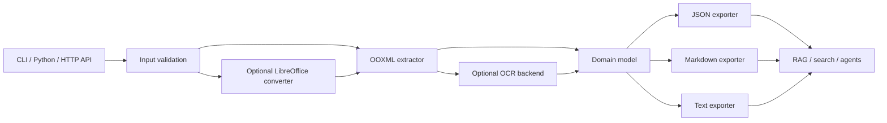

# Architecture

## System shape

The extractor is pure orchestration around `python-pptx`; OOXML safety checks run before it. Optional
dependencies are loaded only when requested. Exporters depend on the domain model, never on PowerPoint
objects, so output behavior can be tested independently.

## Package map

| Path | Responsibility | Public entry points |
|---|---|---|
| `src/pptx_extraction/models.py` | Versioned serializable domain records | `PresentationRecord`, `SlideRecord`, `ExtractionOptions` |
| `src/pptx_extraction/security.py` | OOXML/ZIP validation and source hashing | `validate_package`, `sha256_file` |
| `src/pptx_extraction/extractors/pptx.py` | Shape traversal and PowerPoint semantics | `PptxExtractor.extract` |
| `src/pptx_extraction/ocr.py` | Lazy OCR protocol and Tesseract adapter | `create_ocr_backend` |
| `src/pptx_extraction/exporters.py` | JSON/Markdown/text serialization | `export_record` |
| `src/pptx_extraction/pipeline.py` | Atomic output orchestration | `extract_file`, `inspect_file`, `batch_extract` |
| `src/pptx_extraction/converter.py` | Optional legacy Office conversion | `convert_legacy` |
| `src/pptx_extraction/cli.py` | Stable command/exit-code interface | `main` |
| `src/pptx_extraction/api.py` | Optional bounded job service | `create_app` |

## Data contract

`schema_version` is currently `1.0`. Every presentation carries a source hash, sanitized source name,
metadata, slide size, slides and warnings. Slide children carry both semantic content and source locators.
Bounding boxes are expressed in points and normalized ratios so consumers are independent of Office EMUs.
Image file names use the first 16 SHA-256 characters and the detected extension.

Exit codes: `0` success, `2` usage/validation error, `3` extraction failure, `4` partial batch failure and
`5` optional dependency unavailable.

## Deployment notes

The CLI/Python library is the primary production surface. The API intentionally stores state on one node and
uses a bounded thread pool. Multi-node deployments should replace the local job store with a durable queue,
object storage and authenticated result URLs without changing the extraction package.
